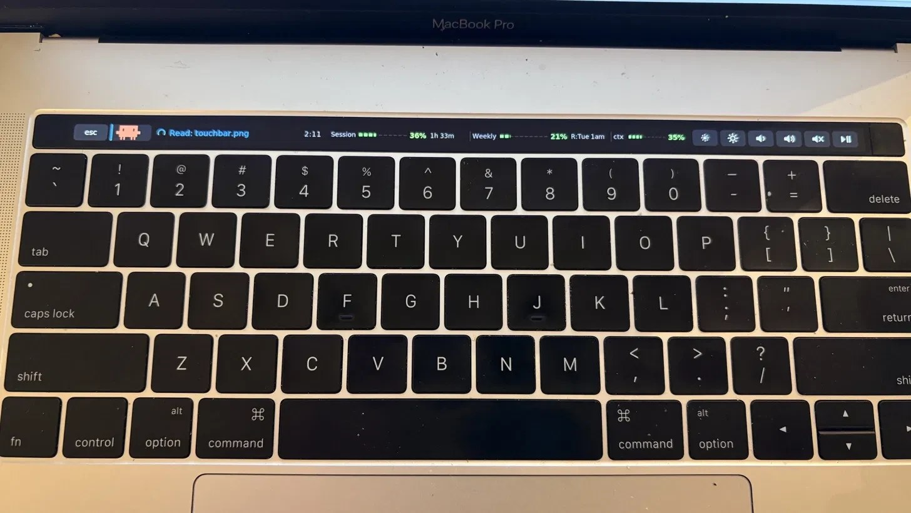
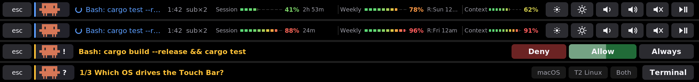

# Claude Touch Bar

Shows what Claude Code is doing on the **T1 MacBook Pro Touch Bar under Linux**, and lets you answer
permission / plan prompts by touching the bar. Spec: [SPEC.md](SPEC.md) (see its §12 for what is built).

> **Tested only on: MacBook Pro 2016 (15", MacBookPro13,3, T1 chip) + Ubuntu 22.04 LTS** (kernel 6.8 HWE,
> Python 3.10). Other T1 models (e.g. the 13" MacBookPro13,2) and other distributions are untested.
> T2 and Apple-silicon Macs are not supported: their Touch Bars use different drivers.



*On the real hardware: a 2016 15" MacBook Pro (MacBookPro13,3) running Ubuntu 22.04.*



**Status (2026-09-30, MacBookPro13,3):** host-drawn display, live Claude status with claude-pulse-style
Session / Weekly / Context meters, touch keys (brightness, volume, media) all verified on hardware.
Not yet verified: Fn layer, suspend/resume, running as the `ctb-bar` service.
**Known limitation:** after display mode, the stock function row only comes back on reboot (see `packaging/README.md`).

```
Claude Code ─hooks─► bin/ctb-hook ─┐
            ─statusLine► bin/ctb-status ─┤ ctb.sock ─► ctb bridge ─ctb-render.sock─► ctb bar ─► /dev/dfr0 (barkeep)
                                      ◄── decision JSON ─────────────┘                    ▲ touch (hidraw), Fn, uinput keys
```

## Try it without hardware (works today)
```bash
bin/ctb bridge &                                        # the bridge
CTB_BAR_CONFIG=/nonexistent bin/ctb bar --png /tmp/bar.png --sim   # bar → PNG; type simulated touches on stdin
python3 tools/preview.py /tmp/all-modes.png             # render every layout to one PNG
python3 tools/e2e_claude.py allow                       # REAL Claude Code through the hooks (one small model call)
cd tests && python3 -m unittest discover                # 51 tests
```
Simulator touch lines: `tap X`, `hold X MS`, `down X`, `up` (X = pixel, bar is 2170 px wide).

## Install and run it as an app
```bash
git clone https://github.com/ysonggit/claude-touchbar && cd claude-touchbar
./install.sh --check      # optional: check prerequisites only, changes nothing
./install.sh              # asks before each change; uses sudo for the root-level steps
```
`install.sh` checks the machine, installs `python3-cairo`/`python3-pil` if missing, blacklists `hid_sensor_hub`,
finds or builds [barkeep](https://github.com/mgd34msu/barkeep), then runs `bin/ctb install --enable` (hooks,
statusLine, bridge) and `sudo packaging/install-root.sh` (service, sleep hook, app). The stock T1 driver
(`apple_ibridge`) must already be installed. Remove everything with `./install.sh --uninstall`.
Then open **Claude Touch Bar** from Activities (or pin it to the dock). It asks for your password, takes over the
Touch Bar and shows a notification when it is on; open Claude Code and its status appears on the bar.
Right-click the icon → **Stop** to end it; the bar's keys work again, and the stock icons return after a reboot.
Nothing starts at boot: after a reboot you have the normal Touch Bar until you open the app.

## Where the usage numbers come from
- **Terminal `claude`:** the statusLine JSON (`ctb-status`) carries context, 5h/weekly limits, cost, model and effort.
- **Desktop app (Code tab):** it runs hooks but not the statusLine command. So the bridge reads context % and model
  from the session transcript, and polls `api.anthropic.com/api/oauth/usage` every 60 s for the 5h/weekly limits and plan,
  using the Claude Code login token in `~/.claude/.credentials.json` (sent only to api.anthropic.com, never logged).
  Turn the poll off with `[usage] enabled = false` in `~/.config/ctb/config.toml`.

## Install the hooks (user level, reversible)
```bash
bin/ctb install --dry-run      # show the resulting settings.json first
bin/ctb install --enable       # backs up ~/.claude/settings.json, merges hooks + statusLine, starts the bridge
bin/ctb doctor                 # checks everything
bin/ctb uninstall              # restores settings.json exactly
```
With no Touch Bar renderer running, a permission request raises an **alert-only** desktop notification;
you answer in the terminal as usual. Hooks fail open: if the bridge is down Claude Code behaves as normal.

## M0 checklist (needs the hardware; items 1–3 verified on this Mac on 2026-09-30)
1. Blacklist `hid_sensor_hub` and build barkeep (see `packaging/README.md`), then `sudo packaging/ctb-display up`;
   it must report `config 2, /dev/dfr0 ready`. `sudo packaging/ctb-display down` gives the stock driver back, but on 13,3
   the row's icons only return after a reboot (verified 2026-09-30).
2. ~~`ctb probe pattern`: check orientation/colours~~ done 2026-09-30: `rotate = "cw"`, RGB order correct.
3. ~~`ctb probe touch`~~ done 2026-09-30: 52-byte reports, float32 X at offset 0 in [0.5, 1.0]; `touch_device = "auto"`.
   Set `touch_flip = true` if taps land mirrored.
4. Check Fn works (`KEY_FN` from the internal keyboard) and that F-keys/media keys arrive through `/dev/uinput`.
5. Suspend/resume 10× with the sleep hook.
6. Try the AskUserQuestion answering spike (SPEC §6).

## Credits and license
- Host-drawn display, config-2 switching and touch protocol: [barkeep](https://github.com/mgd34msu/barkeep) (GPL-2.0).
  `ctb/bar/panel.py` is a port of its `dispon.py`.
- Status-bar look and the OAuth usage fallback follow [claude-pulse](https://github.com/NoobyGains/claude-pulse).
- The pixel mascot is drawn from Claude Code's own welcome-screen block art. Claude and Claude Code are
  Anthropic's; this is an unofficial project.

Licensed under the GNU General Public License v2.0; see [LICENSE](LICENSE).
